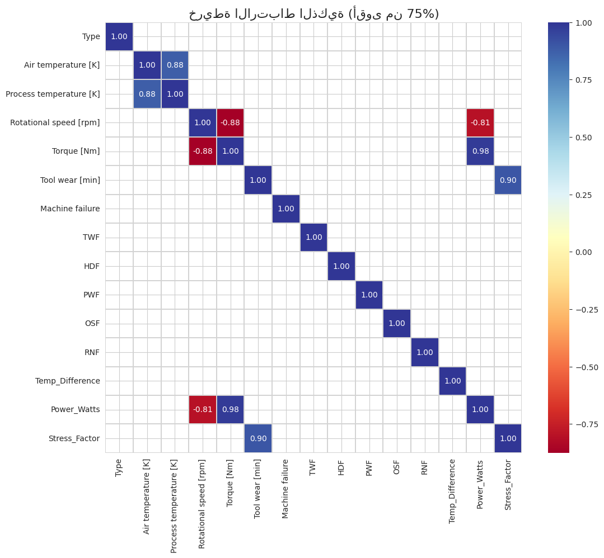

# 🏭 CNC Milling Machine Predictive Maintenance: A Physics-Informed Digital Twin

## 📌 Executive Summary
Unplanned machine downtime is one of the largest cost drivers in modern manufacturing. This project develops an end-to-end **Predictive Maintenance (PdM) Pipeline** and a **Live Digital Twin Dashboard** for a CNC Milling Machine using the AI4I 2020 dataset. 

By combining raw sensor telemetry with **Physics-Informed Feature Engineering**, this system accurately predicts *when* a machine will fail (Prognostics) and diagnoses *which* component will fail (Diagnostics).

---

## ⚙️ Phase 1: Physics-Informed Feature Engineering
Raw sensor data alone lacks the context of the physical stress the machine is experiencing. To give the Machine Learning models a deeper "mechanical understanding," I engineered features based on kinematics and thermodynamics:

1. **Mechanical Power (Watts):** $Power = Torque \times \left( Rotational\_Speed \times \frac{2\pi}{60} \right)$
   * Sudden spikes in actual power consumption indicate tool struggling, a precursor to Overstrain Failure (OSF).
2. **Tool Stress Factor:** $Stress\_Factor = Torque \times Tool\_Wear$
   * A non-linear interaction metric capturing the compounded risk of high torque on a worn tool.
3. **Thermal Inefficiency:** $\Delta T = Process\_Temperature - Air\_Temperature$

### Multicollinearity & Correlation Analysis
Before modeling, I analyzed the relationships between variables. The heatmap below highlights strong correlations (e.g., Torque and RPM), allowing us to drop redundant raw sensors and rely on our engineered physical metrics.



---

## 🧠 Phase 2: Machine Learning Architecture (XGBoost)
The core of the system is driven by **XGBoost**. The feature importance chart below proves that our engineered features (`Power_Watts` and `Stress_Factor`) became top predictors, outperforming raw sensors like air temperature or simple tool wear.


### Overcoming the "Accuracy Trap"
Industrial datasets are highly imbalanced (failures are rare). A model can achieve 96% accuracy by simply guessing "Normal" every time. To build a system that actually saves money on the factory floor, I prioritized **Recall** over absolute accuracy.

**1. Standard Model Evaluation:**
Initially, the standard model missed several critical failures (False Negatives), which is unacceptable in an industrial setting.


**2. Zero-Risk Threshold Optimization (30% Limit):**
By adjusting the decision threshold to **30.0%**, the system became highly sensitive to early degradation signs. The custom threshold significantly increased the True Positive rate (catching failures before they happen), providing operators with a vital early warning system.


---

## 🖥️ Phase 3: Live Digital Twin Dashboard
To bridge the gap between Data Science and the factory floor, the models are deployed into a real-time **Digital Twin UI** using Gradio. 
Operators feed live telemetry, and the system dynamically plots the degradation path, forecasts the **Remaining Useful Life (RUL)**, and issues automated AI action plans.

---

## 📂 Repository Structure

```text
predictive-maintenance-cnc/
│
├── data/
│   └── ai4i2020.csv                              # Raw Kaggle dataset
│
├── notebooks/
│   └── 01_predictive_maintenance_modeling.ipynb  # EDA, Feature Eng, & Model Training
│
├── models/
│   └── milling_ai_bundle_2026.pkl                # Exported Dual-XGBoost models & encoders
│
├── app.py                                        # Gradio Live Dashboard Deployment Script
├── requirements.txt                              # Project dependencies
└── README.md                                     # Project documentation
